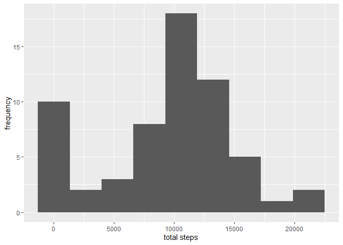
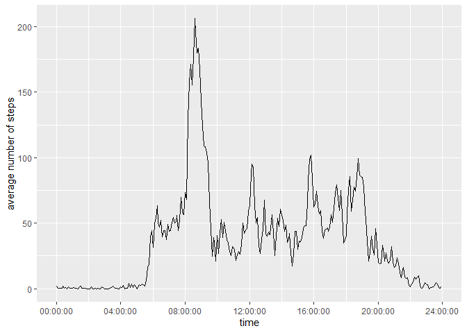
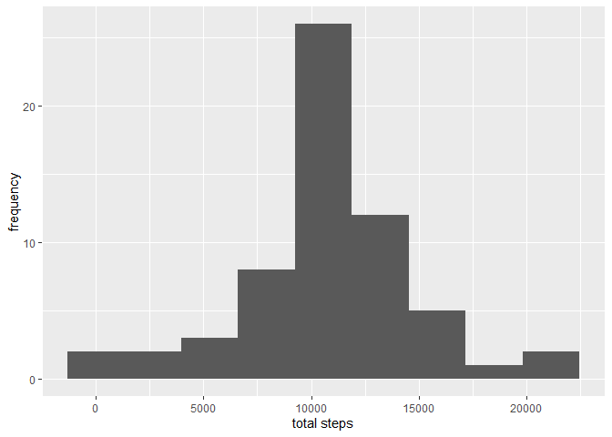
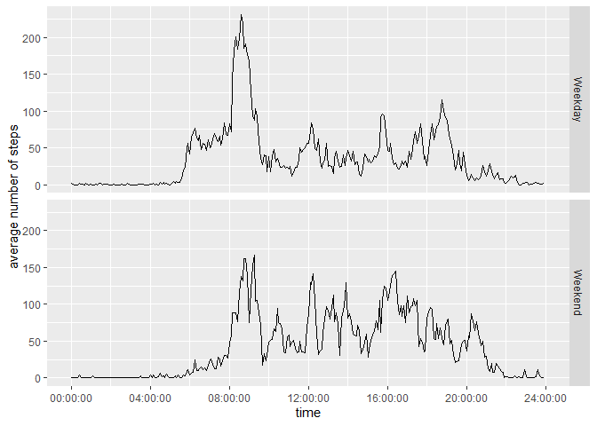

## Loading and preprocessing the data

Firstly, the packages to be used in the analysis were imported.

```r
library(tidyverse)
```

```
## -- Attaching packages --------------------------------------------------------------------------------------------- tidyverse 1.2.1 --
```

```
## v ggplot2 3.2.1     v purrr   0.3.2
## v tibble  2.1.3     v dplyr   0.8.3
## v tidyr   1.0.0     v stringr 1.4.0
## v readr   1.3.1     v forcats 0.4.0
```

```
## -- Conflicts ------------------------------------------------------------------------------------------------ tidyverse_conflicts() --
## x dplyr::filter() masks stats::filter()
## x dplyr::lag()    masks stats::lag()
```

```r
library(lubridate)
```

```
## 
## Attaching package: 'lubridate'
```

```
## The following object is masked from 'package:base':
## 
##     date
```
The data was loaded into R.

```r
activity <- read_csv("activity.csv")
```

```
## Parsed with column specification:
## cols(
##   steps = col_double(),
##   date = col_character(),
##   interval = col_double()
## )
```
The date and interval variables were formatted and combined into a single datetime variable.

```r
activity <- activity %>% 
        mutate(date = dmy(date))

activity <- activity %>% 
        mutate(time = (hm(gsub("(\\d{2}(?!\\d?$))", "\\1:",
                           str_pad(activity$interval, width=4, side="left", pad="0"), perl=T))))

activity <- activity %>% 
        mutate(hour = hour(time))

activity <- activity %>% 
        mutate(minute = minute(time))

activity <- activity %>% 
        mutate(datetime = as.POSIXct(activity$date + activity$time))

activity <- activity %>% 
        mutate(time = hms::as_hms(activity$datetime))
```

## What is mean total number of steps taken per day?

The data were grouped by day and then summarised by step total. 

```r
total_steps <- activity %>% group_by(date) %>% 
        summarise(total = sum(steps, na.rm = TRUE))
```

A histogram was then plotted using ggplot.

```r
ggplot(data = total_steps, mapping = aes(total)) + geom_histogram(bins = 9) + 
        xlab("total steps") + ylab("frequency")
```

<!-- -->

The mean and median total steps were calculated.

```r
mean <- formatC(mean(total_steps$total), format = "d")
median <- formatC(median(total_steps$total), format = "d")
```
The mean number of total steps per day is 9354 and the median number of total steps per day is 10395

## What is the average daily activity pattern?
The data were grouped by interval and then summarised ove all days by the average step count. 

```r
average <- activity %>% group_by(hour,minute) %>% 
        summarise(ave_steps = mean(steps, na.rm = TRUE)) %>%
        mutate(time = hms::as_hms(ymd_hms("2012-10-01 00:00:00") + hours(hour) + minutes(minute)))
```

A time series plot was then plotted showing the average number of steps taken for each 5 minute interval, averaged over all days

```r
ggplot(data = average, mapping = aes(x = time, y = ave_steps, group = 1)) + geom_line() +
        xlab("time") + ylab("average number of steps") + 
        scale_x_time(limits = c(0,86400), breaks=seq(0,86400,14400))
```

<!-- -->


```r
maxsteps <- max(average$ave_steps)
maxint <- average$time[which(average$ave_steps == maxsteps)] %>% as.character()
```

The 5 minute interval, on average across all the days in the dataset, containing the maximum number of steps is that at 08:35:00.  

## Imputing missing values

The number of missing values was evaluated.

```r
num_nas <- sum(is.na(activity$steps))
```
The total number of missing values in the dataset is 2304

The missing values were then imputed by replacing missing values with the mean value for that 5 minute interval across all days.

```r
impute <- activity %>% mutate_at(1, ~replace(.,is.na(.), average$ave_steps))
```
The first few rows of the imputed data are shown above.


The data were grouped by day and then summarised by step total. 

```r
new_total_steps <- impute %>% group_by(date) %>% 
        summarise(total = sum(steps, na.rm = TRUE))
```

A histogram was then plotted using ggplot.

```r
ggplot(data = new_total_steps, mapping = aes(total)) + geom_histogram(bins = 9) + 
        xlab("total steps") + ylab("frequency")
```

<!-- -->

The mean and median total steps were calculated.

```r
new_mean <- formatC(mean(new_total_steps$total), format = "d")
new_median <- formatC(median(new_total_steps$total), format = "d")
```
The mean number of total steps per day is 10766 and the median number of total steps per day is 10766

## Are there differences in activity patterns between weekdays and weekends?

A new factor variable was created, which indicates which dates are weekends/weekdays.

```r
weekday <- impute %>% 
        mutate(day = case_when(weekdays(date) %in% c("Saturday","Sunday") ~ "Weekend",
                                weekdays(date) %in% c("Monday","Tuesday","Wednesday","Thursday","Friday") ~"Weekday"))
```

The data was summarised by average number of steps over all days.

```r
average2 <- weekday %>% group_by(day,hour,minute) %>% 
        summarise(ave_steps = mean(steps, na.rm = TRUE)) %>%
        mutate(time = hms::as_hms(ymd_hms("2012-10-01 00:00:00") + hours(hour) + minutes(minute)))
```

Time series plots of avergae number of steps for both weekdays and weekends were plotted.

```r
ggplot(data = average2, mapping = aes(x = time, y = ave_steps, group = 1)) + facet_grid(rows = vars(day)) + 
        geom_line() +
        xlab("time") + ylab("average number of steps") + 
        scale_x_time(limits = c(0,86400), breaks=seq(0,86400,14400))
```

<!-- -->

From this plot, we can see that, on average, the person takes more steps between 6am and 8am on weekdays, and they are more active after 8pm at weekends. On weekdays there is a spike in activity around 9am on weekdays, after which activity is much lower. On weekends, the activity is more evenly spread throughout the day.
